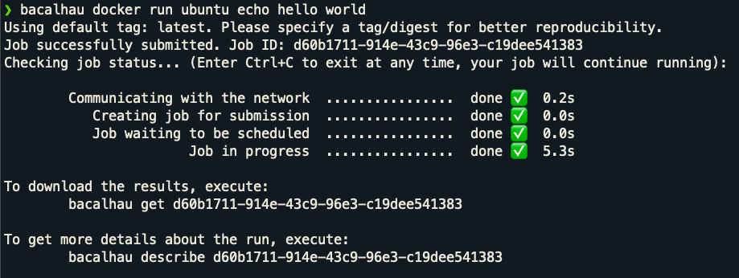

# Instructions to Run this Example

## Introduction
These are the instructions for running the example. It assumes you have a cluster setup (see [ClusterSetup.md](Cluster Setup)) and a container to run (see [BuildingContainer.md](Building Container)).

## Architecture
The overall story of what you are doing here is the following:
* You have a set of nodes in a variety of regions.
* Each node is generating information - log files, metrics, etc.
* You'd like to process this information at the point of creation - to filter, to get quicker responses, more efficiently, etc.
* We'll use DuckDB to run the job remotely, and produce these results.

## Node layout
On each node, the files are laid out in the following way:
* `/var/log/` - log files
* `/var/log/aperitivo_logs` - live log files for aperitivo
* `/var/log/logs_to_process` - log files that have been rotated out. These are the files that we want to process.
  * `aperitivo_logs.log.1` - the most recent log file, uncompressed
  * `aperitivo_logs.log.2.gz` - the previous log file, compressed
  * `aperitivo_logs.log.N.gz` - the Nth log file, compressed

Your job will only have access to the `/var/log/logs_to_process` directory - this is set up by running the server with the `--allow-listed-local-paths '/var/log/logs_to_process/**'` flag (you can read more about these options here: [Bacalhau Server Options](https://docs.bacalhau.org/running-node)).

## Running the Job
To run the job, you'll need a local client. You can install this with the following command:
```bash
curl -sL https://get.bacalhau.org/install.sh | bash
```

You will also need to source the bacalhau.run file to get the correct environment variables. To do so, this from the main, run:

```bash
# This file will be in your terraform directory, if you used terraform to set up your cluster. Otherwise, it will be on any node in the /run/bacalhau.run file or the variable values will be in the /etc/bacalhau-bootstrap file.
source terraform/bacalhau.run 
```

You will have to update the BACALHAU_API_HOST environment variable with the correct one. After you set the environment variables, you can run the following command to check that everything is working:

```bash
export BACALHAU_PEER_CONNECT=/ip4/100.76.225.105/tcp/44635/p2p/QmRrs2aDsuTek5rEze6XTHbqSnta7qr3Co1KFRpfvuTBui 
# Command to get the IP address (the second field) in the BACALHAU_PEER_CONNECT variable:
export BACALHAU_API_HOST=$(echo $BACALHAU_PEER_CONNECT | cut -d'/' -f3)
```

You are now ready to run a job. To run a quick test, run the following command:
```bash
bacalhau docker run ubuntu echo "Hello World"
```

Your output should take <5 seconds, and give you a result that looks like this:


## Running DuckDB against logs
To do something a bit more advanced, let's use DuckDB to process a log file. To run a job on a single node, you will select a node to run the job on. Assuming you have the following zones:
* europe-west9-a
* us-east4-a
* southamerica-east1-a

You can run the job on the europe-west9-a node with the following command:
```bash
bacalhau --network=full -i file:///var/log/logs_to_process:/var/log/logs_to_process docker run docker.io/bacalhauproject/duckdb-log-processor:v1.0.7 -- /bin/bash -c "python3 /process.py /var/log/logs_to_process/aperitivo.log.1 \"SELECT * FROM logs WHERE log_level = 'SECURITY'\""
```

Breaking down the above flags:
* `--network=full` - this will run the only on nodes that have networking enabled.
* `-i file:///var/log/logs_to_process:/var/log/logs_to_process` - this will mount the `/var/log/logs_to_process` directory (form the host node) to the `/var/log/logs_to_process` directory in the container.
* `docker run docker.io/bacalhauproject/duckdb-log-processor:v1.0.7` - this will run the docker container `docker.io/bacalhauproject/duckdb-log-processor:v1.0`
* `-- /bin/bash -c ` - this will run the command in the container on the node (command must have quotes around it). The arguments are: 
  * `python3 /process.py` - run python3
  * `/process.py` - the script already built into the container
  * `/var/log/logs_to_process/aperitivo.log.1` - the file to process
  * `SELECT * FROM logs WHERE log_level = 'SECURITY'` - the SQL query to run on the file (must be surrounded by escaped quotes (`\"`))

You can get the results of the job by running the following command:
```bash
bacalhau describe <JOBID>
```

And fetch the results of a job with the following command:
```bash
bacalhau get <JOBID>
```

Our container will also upload the results to a bucket. The bucket name is `APPNAME-ZONE-archive-bucket` and the file name will be `$APPNAME-<ZONE>-vm-<TIMESTAMP>.json`. To see all your buckets, run:

```bash
gcloud storage ls
```

To see the contents of a bucket, run:

```bash
gcloud storage ls gs://<BUCKET NAME>/
```

To see the contents of a file, run:

```bash
gcloud cat gs://<BUCKET NAME>/<FILE NAME>
```

You can also run all of these commands from a yaml file with `cat <FILE NAME> | bacalhau create`. For example, to run the above command, you can run:

```bash
cat job.yaml | bacalhau create
```

## Running across all nodes
The above job runs on just one node. To run the same job on all nodes, so you can query every log on your network, you can run the following command:
```bash
NUMBER_OF_NODES=4
bacalhau --concurrency $NUMBER_OF_NODES --network=full -i file:///var/log/logs_to_process:/var/log/logs_to_process docker run docker.io/bacalhauproject/duckdb-log-processor:v1.0.7 -- /bin/bash -c "/process.py /var/log/logs_to_process/aperitivo.log.1 archive-bucket  \"SELECT * FROM logs WHERE log_level = 'SECURITY'\""
```

Breaking down the above flags:
* `--concurrency $NUMBER_OF_NODES` - this will run the job on $NUMBER_OF_NODES nodes.
* `--network=full` - this will run the only on nodes that have networking enabled.
* `-i file:///var/log/logs_to_process:/var/log/logs_to_process` - this will mount the `/var/log/logs_to_process` directory (form the host node) to the `/var/log/logs_to_process` directory in the container.
* `docker run docker.io/bacalhauproject/duckdb-log-processor:v1.0.7` - this will run the docker container `docker.io/bacalhauproject/duckdb-log-processor:v1.0`
* `--` - separates the docker run command from the command to run in the container.
* `/process.py` - the script already built into the container
* `/var/log/logs_to_process/aperitivo.log.1` - the file to process
* `SELECT * FROM logs WHERE log_level = 'SECURITY'` - the SQL query to run on the file (must be surrounded by escaped quotes (`\"`))

You can also execute this with the following yaml file:
```yaml
Job:
  APIVersion: V1beta1
  Spec:
    Deal:
      Concurrency: 112
    Docker:
      Entrypoint:
        - /bin/bash
        - -c
        - python3 /process.py aperitivo_logs.log.1 archive-bucket "SELECT * FROM log_data WHERE message LIKE '%[SECURITY]%' ORDER BY '@timestamp'"
      Image: docker.io/bacalhauproject/duckdb-log-processor:v1.0.7
    Engine: Docker
    Network:
      Type: Full
    inputs:
      - Name: file:///var/log/logs_to_process
        SourcePath: /var/log/logs_to_process
        StorageSource: LocalDirectory
        path: /var/log/logs_to_process
```

and the following command:
```bash
cat job.yaml | bacalhau create
```

With all that, you have a system that can run distributed queries across many nodes, in a much more secure and reliable way.