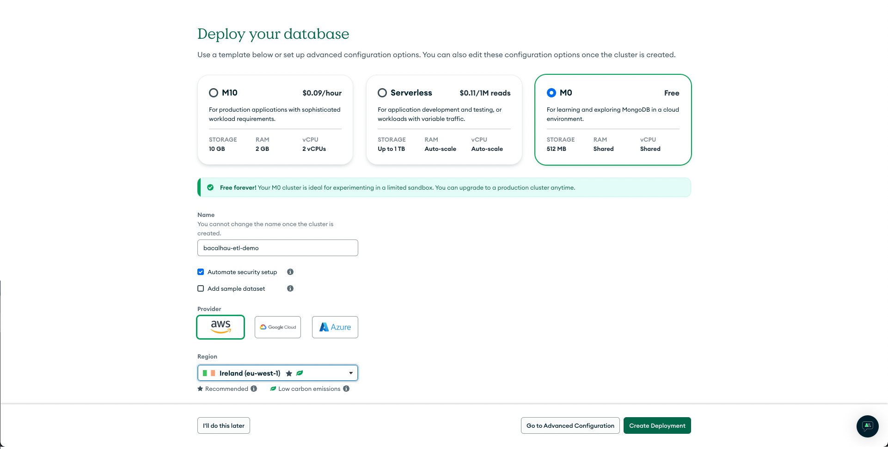

# Deploy a Multi-region ETL Pipeline with Bacalhau for MongoDB

In this guide, we will cover deploying, querying, and aggregating data distributed in MongoDB databases globally.

You will need:

- [The Bacalhau CLI](https://docs.bacalhau.org/getting-started/installation)
- A UNIX-based Computer (macOS/Linux)
- [A Google Cloud account](https://cloud.google.com/)
- A Terminal
- [Terraform](https://www.terraform.io/)
- Git

## Overview

In this document, we will spin up our own distributed network of databases across multiple regions of Google Cloud and then apply the ETL ([Extract-Transform-Load](https://en.wikipedia.org/wiki/Extract,_transform,_load)) pattern to the data that is being stored in each location with Bacalhau.

### The Problem

Why are we doing this? Well, modern infrastructure generates a lot of data in many different places. Keeping tabs on that data and accessing it when you want to gain some insight can be both logistically complex and expensive.

Typically, there are two approaches:

1. You can aggregate data from all of your data sources in a centralised location and perform queries on that new, larger datastore.

2. You can process your data close to, or at the source of its generation, and then aggregate the results somewhere else for further analysis.

Both approaches present challenges that aren't easy to overcome. When aggregating all your data, there are multiple factors in play that can make the approach even more challenging: Cost of bandwidth, cost of centralised storage, time to execute queries and more.

Processing data on the edge can tackle some of those issues, but it comes with its own challenges. Namely: Tracking your infrastructure, communicating, and executing remotely on those data sources, and having a consistent, repeatable way to manage each individual data source.

### The Solution

That's where [Bacalhau](https://bacalhau.org) comes in! 

With Bacalhau, we can create a common interface for querying and filtering data at each source point and then aggregate a reduced set of key data points for further analysis at a central location.

This process tackles the problems presented by both typical approaches. Instead of incurring fees and long wait times to transfer all your data from different sources, we extract only the data that we consider to be useful for any given application.

Compared with the first approach, this means less bandwidth and storage utilisation, and a smaller centralised data source from which we can derive greater insight into our data, faster.

For the second approach, we have a secure, consistent interface with which to execute processing on our data across the totality of our infrastructure, without having to consider the overhead of multi-regional, multi-cloud deployments.

## What are we going to build?


- An example infrastructure across 4 regions in a Google Cloud account:
    - Which sets up MongoDB at multiple locations across the world
    - Installs a small Python script on each instance that records system statistics and writes them to the local MongoDB instance.
    - And Installs Bacalhau at each location, creating a private cluster for compute execution
- Deploy a Bacalhau job at each location for processing data
- Filter that data at source for key datapoints
- Send that filtered data to MongoDB Atlas for aggregation and further analysis.

## Setup

### Installing Bacalhau

To run through this example, you'll first need to install the Bacalhau CLI tool on your local system. Follow [these instructions](https://docs.bacalhau.org/getting-started/) to get your local system setup, and then carry on with this example project.

This will enable you to interact with the private network that we'll be setting up with the Terraform script we've included with this project.

### Installing Terraform

As this project uses Terraform to build, deploy, and manage the example infrastructure

### Setting up MongoDB Atlas

For this example, project, we're going to be aggregating our filtered data in a [MongoDB Atlas](https://www.mongodb.com/atlas/database) database. We're using Atlas for this example, as it has an abundant free-tier that we can use to experiment and explore with. Additionally, we'll be coupling it with [MongoDB Community Edition](https://www.mongodb.com/try/download/community) in each of our deployed instances, we can keep the exact same data structure and interfaces to talk to both our centralised database, as well as those at the edge.

#### Creating a MongoDB Account

To get started, head over to the [MongoDB Atlas home page](https://www.mongodb.com/atlas/database), and click the "Try Free" button. Follow the instructions in the form to create an account which will enable us to spin up a MongoDB Atlas deployment.


#### Creating a MongoDB Atlas Deployment

Once you've completed the sign-up process, you will be taken to your new account's "Overview" page. Click the "Create a deployment" button (highlighted in red).


This will take you to a form where you can deploy the database. For the purposes of this demo:

1. Select the M0 type database
2. Give it a sensible name that you'll remember
3. Uncheck the 'Add sample dataset' box
4. Select your preferred cloud provider for hosting the database
    - This won't spin up anything in your account, the database will be created in MongoDB's account with your preferred provider.
5. Select a region for the instance to be deployed in.
    - You can choose any region you like - it doesn't greatly matter which one you pick at this point, but where possible, try to pick something closest to your geographical location to reduce latency later when we're interacting with our stored data.

Once you've filled in the form, click "Create Deployment".



#### Adding a Database User 

Once the deployment process has finished, you will be presented with a modal that will allow you to create a connection to your new Atlas instance. 


We don't need to do all of this right now, but copy the username and password presented in the form as the default user, and save them somewhere secure on your system. We will need this information later. Then, click the "Create Database User" button. 

Once the user has been created, we don't need to follow the rest of the process at this point, so you can close the modal with the 'x' button at the top-right corner.

#### Enabling Access from the Internet

The last step in this process is enabling access to our Atlas database through the public internet. If you prefer, it's completely possible to specify the IP addresses of your instances for direct access after deploying the Terraform script, but as we do not know what our IP addresses are yet, we're just going to open it up to the public internet for access.

*Please note: This doesn't mean absolutely anybody on the internet will be able to access the data on our instance. Connections will still be secured over TLS and protected by the username/password combo we just saved.*

In the sidebar of the Atlas interface, click the "Network Access" tab (highlighted in purple).


You'll be taken to an overview page which will contain the IP address of the computer we just created our database from in a table.

To the top-right of that table, click the "ADD IP ADDRESS" button (highlighted in blue), and in the modal that appears, click "ALLOW ACCESS FROM ANYWHERE", and then "Confirm".

Your MongoDB Atlas Database is now setup for access!

#### Getting your Connection String

The last thing we need to do before we move on is get a connection string that we can use to connect to Atlas from our Bacalhau jobs later.

Click on the "Overview" tab of the Atlas sidebar, and in the "Database Deployments" section of the page, click the "Connect" button (highlighted) in pink.


We aren't going to connect right now, but we can get the string we need for connections in this dialog. Click the "Compass" option, and under Step 2 (highlighted below in red), copy the entire string and put it somewhere for later. Now would be a good time to replace the `<password>` section of the string with the password we copied when creating our database user.


### Setting up a Google Cloud account

First, you need to install the Google Cloud SDK. Depending on your platform, you will need to install it from a package manager, or directly compile it. You can find the instructions to do so are [here](https://cloud.google.com/sdk/docs/install).

After installing, you need to login to your Google Cloud account. [Full Instructions](https://cloud.google.com/sdk/docs/initializing). For most platforms, you should simply type:
```bash
gcloud auth login
```

After logging in, you need to create a project. [Full Instructions](https://cloud.google.com/resource-manager/docs/creating-managing-projects).

```bash
PROJECT_ID="my-project"
gcloud projects create $PROJECT_ID
```

You also need to get your billing account ID. 

```bash
gcloud beta billing accounts list
BILLING_ACCOUNT_ID="0136BA-110539-DCE35A"
```

Finally, you need to link the billing account to the project. [Full Instructions](https://cloud.google.com/billing/docs/how-to/modify-project).
  
```bash
gcloud beta billing projects link $PROJECT_ID --billing-account $BILLING_ACCOUNT_ID
```

Finally, you need to enable the compute API and storage API. [Full Instructions](https://cloud.google.com/apis/docs/getting-started).

```bash
gcloud services enable compute.googleapis.com
gcloud services enable storage.googleapis.com
```

This `$PROJECT_ID` will be used in the .env.json file in `project_id`.

## Deploying our Infrastructure

For this project, we're using Terraform to orchestrate our infrastructure. If you've not done so already, now is a good time to install Terraform on your local system. You can find instructions on that [here](https://learn.hashicorp.com/tutorials/terraform/install-cli).

Our Terraform project defines and utilises a few key things to demonstrate an effective ETL pipeline with Bacalhau.

### Keys parts

1. 4 Google Cloud VPS
    - One instance located in London, Belgium, Singapore, and South Carolina
2. Terraform directory
    - A `cloud-init` script which will run on, and configure, each VPS as it spins up
    - A `node_files` directory which contains the service and shell scripts for generating entries in our local database and configuring our private Bacalhau cluster.
    - `env.json` - a configuration file that we will add values to on our local system to help authenticate and configure our instances at deployment time.
3. `scripts` directory
    - The folder contains some Python scripts which will generate reports every 1/3 of a second on the status and utilisation of our servers. We'll be filtering and extracting these reports with the help of Bacalhau later.

### Setting up env.json

In the `terraform` directory, there is a `.example.env.json`

### Deploying your Private Cluster

If you've not already, clone this repo to your local system and use your Terminal to navigate to the root folder of this project.

Once there, `cd` in to the `terraform` directory.

Then, initialize Terraform. This will download the plugins needed to run the script.
```bash
terraform init
```

Next, we generate the 'plan' for our deployment. This will create a `plan.out` file in our `terraform` directory which will describe all the steps and resources needed to deploy our infrastructure. Run the following command to generate the plan.

```bash
terraform plan -out plan.out -var-file .env.json
```

This will show you what resources will be created. You should see a list of instances, an Object Storage bucket (which will be used to store and retrieve some of our Python scripts), and a network interface specifying which ports we would like to have open on each instance.

If you are happy with the plan, you can apply it.
```bash
terraform apply plan.out
```

This will take a few minutes to spin up, at the end of which, Terraform will tell you that the deployment has been successful (provided there have been no errors).

When you finish with this example project, you may wish to clean up the deployed infrastructure. To do so, you can run the following commands, which will delete all resources and assets generated by this Terraform script:
```bash
terraform plan -out plan.out -var-file .env.json -destroy && terraform apply plan.out
```

### Deploying a job on your Cluster

Once your private cluster is spun up, it'll take a few moments for the Python scripts to start writing logs to its local MongoDB installation.

After a few minutes, we're ready to fire off a job to each of our nodes to filter our logs for any instances where more than 50% of the system's CPU has been utilised at a given point in time. We then forward only those records to Atlas for further analysis.

To fire off your first job, we first need to get the IP address for the instance that's hosting our requester node - that is, the node which will be responsible for dispatching all jobs to each of the compute nodes in our networks.

For simplicity, in our `.env.json` file, we define the zone that this instance is with the `bootstrap_zone` key.

If you wish, you can log in to your Google Cloud account dashboard, and look for the public IP address assigned to the instance that is in the `bootstrap_zone` defined in our ``.env.json` file, but for convenience, our Terraform script will have saved the IP address for that instance in a `bacalhau.run` file which can be found in the `terraform` directory.

Open it up, and copy the address to your clipboard, then open your CLI and paste the following command, but don't execute it quite yet.

`bacalhau --api-host=<YOUR_PUBLIC_IP_ADDRESS> --selector region=<TARGET_REGION> --network=full --wait=false  docker run -e LOCAL_CONN="mongodb://0.0.0.0:27017" -e REMOTE_CONN="<YOUR_ATLAS_CONNECTION_STRING>" -e LOCATION="<TARGET_REGION>" seanmtracey/smt-mongo-etl:0.0.43`

There are a couple of flags that we need to fill in with some information for our job to complete successfully.

#### --api-host
The public IP address of our orchestrator node that we copied from the `bacalhau.run` file, or from the Google Cloud Dashboard.

#### --selector region=<TARGET_REGION>
The region that we want to deploy our job in and filter and extract the records from. Valid regions can be found in the `.env.json` file as the `region` key in each item in the `locations` object.

```json
{
    "locations": {
        "europe-west2-a": {
            "region": "europe-west2", // Valid region value
            "storage_location": "EU"
        },
    /// { ... }
}
```

#### -e REMOTE_CONN

This is where we will use the Atlas connection string we generated when we first set up our Atlas database.

#### -e LOCATION="<TARGET_REGION>"

This is the same value as we use in `--selector region=<TARGET_REGION>`. This value will be added to the filtered data retrieved from each MongoDB database installed on each of our instances so we know where each record has come from.

Replace the values in the above Bacalhau command with your values, then run the job.

This will launch the `seanmtracey/smt-mongo-etl:0.0.43` container in the instance you've selected to filter and extract data from. Every 30 seconds, it will retrieve all records from the local MongoDB database, filter them for records where the `system_cpu_used` is greater than 50 (indicating more than 50% of the available CPU resource on a system), and will forward those records to our Atlas database.

You should see a v4 UUID returned in the CLI. This is the id of the job we just submitted. 

We now have our ETL code running on our private Bacalhau cluster! 

Repeat the steps for running the job on each of our instances by replacing the `region` parameters of the last command we ran in your terminal.

## Viewing the Results

At this point, our jobs are running, data is being generated, stored, transformed, and extracted from each of our locations.

Now it's time to check out what has been sent to our Atlas store! Wait for a few moments for a decent amount of data to build up, then head back to your MongoDB dashboard and click the "Database" item in the dashboard sub-menu (highlighted below in red).

.

Once the Database view has loaded, click the "Browse Collections" button. This will load all the records stored in our Atlas database.

.

And, if all has gone well, you should see a database filled with records from each of our locations showing only the information that we have deemed useful in this circumstance (that is, instances that are utilising greater than 50% of our CPU capacity).

That's it! We've built a distributed ETL pipeline, deployed it around the world, and extracted only the important records back for visibility and analysis. Feel free to query your newly filtered data and explore what's going on across your network.

.


## Additional Reading

And with that, we have an ETL pipeline that can extract, transform, and load our data from any number of data sources across the internet and aggregate them into a MongoDB Atlas Database!

But there is more we can do! 

If you would like to learn more about the best practices for setting up a Private Cluster with Bacalhau and how to secure it [we have a blog post on that](https://blog.bacalhau.org/p/setting-up-a-bacalhau-cluster-tips).
