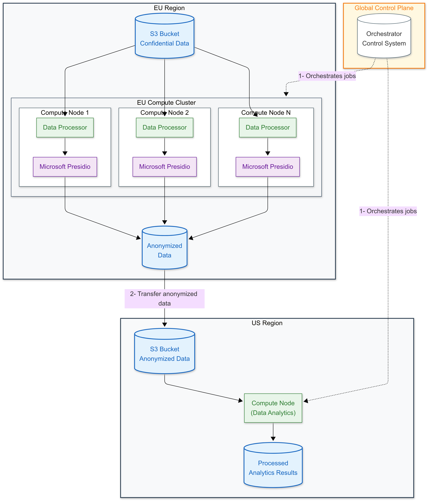

# Cross-Border Data Processing with Privacy Compliance - Through Bacalhau

## Background and Problem Statement

In today's globally connected world, organizations face significant challenges when handling sensitive data across different jurisdictions and geographical boundaries. Data privacy regulations such as GDPR in Europe, CCPA in California, and various other regional data protection laws impose strict requirements on how personal and sensitive information can be stored, processed, and transferred across borders. Organizations must ensure that sensitive data remains within its original jurisdiction while still enabling global data analytics and processing capabilities.

The core challenge lies in maintaining data sovereignty while enabling cross-border analytics. For instance, when personal data is collected in the European Union, regulations often require that this data remains within EU borders unless specific conditions are met. However, organizations still need to perform analytics on this data in other regions, creating a complex compliance challenge that requires careful architectural considerations.

## Data Anonymization with Microsoft Presidio

To address these compliance requirements, we leverage Microsoft Presidio, an advanced open-source data protection and anonymization toolkit. Presidio employs sophisticated AI models to identify and anonymize sensitive information in both structured and unstructured data formats. It can process various content types, including:

- Unstructured text documents and communications
- Emails and business correspondence
- Internal memos and reports
- Images containing sensitive information
- Business documents and forms

Presidio's strength lies in its ability to recognize multiple types of Personally Identifiable Information (PII) using advanced NLP models. It can identify and sanitize sensitive elements such as names, addresses, identification numbers, and other personal information while maintaining the document's overall structure and meaning. This capability makes it an ideal solution for preparing data for cross-border transfers while maintaining compliance with data protection regulations.

## The Need for Distributed Processing

While Presidio provides robust anonymization capabilities, organizations often need to process large volumes of data efficiently. This requirement calls for a distributed processing approach that can:

- Handle data processing tasks in parallel across multiple nodes
- Maintain data locality and sovereignty requirements
- Ensure efficient resource utilization
- Provide reliable job orchestration and monitoring
- Scale processing capabilities based on demand

Traditional distributed processing solutions often involve complex setup procedures, challenging infrastructure management, and significant operational overhead. Organizations need a simpler, more streamlined approach to deploying and managing these distributed workloads while maintaining strict compliance with data protection requirements.

## Introducing the Bacalhau Solution

To demonstrate an effective approach to this challenge, we've developed a proof-of-concept using Bacalhau, a distributed computation platform. Our solution showcases how organizations can effectively process sensitive data across regions while maintaining compliance with data sovereignty requirements. The demonstration uses Docker Compose to simulate a real-world deployment, making it easy to understand and test the concepts in a controlled environment.

In the following sections, we'll detail the technical implementation of this solution, including the architecture, deployment process, and operational considerations. We'll demonstrate how Bacalhau orchestrates the distributed processing of sensitive data, ensuring that raw data never leaves its jurisdiction of origin while enabling global analytics capabilities through properly anonymized data.


## Solution Architecture

Our solution implements a sophisticated multi-regional data processing architecture that strictly adheres to data sovereignty requirements while enabling efficient cross-border analytics. The architecture consists of three main components: an orchestration layer, regional compute resources, and distributed storage systems.



### Regional Data Sovereignty

The architecture maintains strict data boundaries by implementing separate storage and compute resources in different geographical regions. In the European region, we maintain a secure MinIO storage bucket that houses the confidential data, paired with dedicated compute nodes running Microsoft Presidio for data anonymization. This setup ensures that sensitive data remains within EU boundaries at all times, complying with data protection regulations.

A parallel infrastructure exists in the US region, consisting of its own MinIO storage bucket and compute resources. However, this region only receives and processes already anonymized data, ensuring compliance with cross-border data transfer regulations.

### Orchestration and Control

At the heart of our architecture lies the Bacalhau orchestrator node, which coordinates the entire data processing workflow. The orchestrator manages job distribution, resource allocation, and workflow coordination without ever handling the sensitive data directly. This separation of control plane and data plane is crucial for maintaining security and compliance.

### Distributed Processing

The compute layer consists of multiple worker nodes deployed in the EU region, each capable of running Microsoft Presidio for data anonymization. These nodes operate in parallel, processing different portions of the confidential data simultaneously. This distributed approach not only improves processing efficiency but also maintains data locality, ensuring that sensitive information never leaves its designated security boundary.

### Secure Data Flow

The data flow follows a strict pattern:
1. Confidential data resides in the EU region's MinIO bucket
2. EU-based compute nodes process and anonymize the data using Microsoft Presidio
3. Only anonymized results are transferred to the US region's MinIO bucket
4. US-based compute nodes can then perform analytics on the sanitized data

This architecture demonstrates how organizations can leverage distributed computing to maintain compliance with data protection regulations while enabling global data analytics capabilities. The solution is packaged as a self-contained demonstration environment using Docker Compose, making it easy to deploy and test in any environment.


# Running the Demo Environment

## System Requirements

Before starting, ensure your system meets the following minimum requirements:
- 20 GB of free disk space
- 4 CPU cores
- Docker and Docker Compose installed

## Setup and Deployment

### Step 1: Deploy the Stack

Start by deploying the full stack using Docker Compose:

```bash
docker compose -f full-bacalhau-deployment.yml up --build
```

This process will take a few minutes to complete. You can safely ignore the TLS handshake error messages from the registry (`http: TLS handshake error from [::1]:35061: EOF`).

### Step 2: Access the Environment

Once the stack is running, access the jumpbox container where you'll interact with both Bacalhau and MinIO:

```bash
docker exec -it docker-compose-bacalhau-jumpbox-node-1 /bin/bash
```

### Step 3: Configure MinIO Access

Set up aliases for both EU and US MinIO instances:

```bash
mc alias set minio-eu1 http://minio-node-eu1:9000 minioadmin minioadminpass
mc alias set minio-us1 http://minio-node-us1:9000 minioadmin minioadminpass
```

### Step 4: Verify Initial Data State

Check the content of the EU bucket containing confidential data:

```bash
mc ls --recursive minio-eu1/confidential-memos-bucket-eu
```

Verify that the US bucket is empty (it will later contain anonymized data):

```bash
mc ls --recursive minio-us1
```

To examine a sample confidential memo:

```bash
mc cp minio-eu1/confidential-memos-bucket-eu/confidential-memos/memo_3.txt .
```

### Step 5: Review and Run the Anonymization Job

Navigate to the `/app` directory and examine the job specification file `job_anonymize_data.yaml`. This file defines how the data will be processed:

- **Input Sources**: Configures access to the confidential data in the EU MinIO bucket
- **Publisher**: Specifies how the anonymized data will be stored in the US MinIO bucket
- **Task Configuration**: Defines the Docker image containing Presidio and the processing script
- **Resource Allocation**: Specifies CPU, memory, and disk requirements
- **Partitioning**: Enables parallel processing across multiple compute nodes

The job will be executed across two compute nodes, demonstrating Bacalhau's distributed processing capabilities.

After job completion, verify the results in the US bucket:

```bash
mc ls --recursive minio-us1
```

You should see two tar balls containing the anonymized data. When extracted, the structure will look like this:

```
extracted-data/
├── anonymized-memos
│   ├── memo_11.txt
│   ├── memo_13.txt
│   ├── memo_15.txt
│   └── [additional memos...]
├── exitCode
├── stderr
└── stdout
```

Sample anonymized content will look like this:

```
During routine compliance checking, the following irregularities were noted:
1. Account <IBAN_CODE> showed unusual patterns
2. User <PERSON> accessed system from unregistered IP <DATE_TIME>
[...]
```

### Cleanup

When you're finished experimenting, clean up the environment:

1. Exit the jumpbox container
2. Stop the stack:
```bash
docker compose down
```

3. Clean up volumes:
```bash
docker volume prune
```

Feel free to run additional jobs and experiment with different configurations. The environment is designed to be easily reset and redeployed as needed.


# Understanding Data Sources and Publishing Configuration

## Input Sources Configuration

The input source configuration defines how Bacalhau accesses and retrieves data from the EU region's S3-compatible storage. This configuration is crucial for maintaining data sovereignty and enabling efficient parallel processing.

```yaml
InputSources:
  - Target: "/put-my-s3-data-here"
    Source:
      Type: s3
      Params:
        Bucket: "confidential-memos-bucket-eu"
        Key: "confidential-memos/"
        Endpoint: "http://minio-node-eu1:9000"
        Region: "us-east-1"
        Partition:
          type: object
```

The configuration specifies several important aspects:

The `Target` field defines the mount point within the container where the data will be accessible. This creates a clean separation between storage access and data processing.

The `Source` configuration identifies the EU MinIO instance as an S3-compatible storage system. The `Endpoint` parameter points specifically to the EU node, ensuring data is pulled from the correct geographical region.

Most notably, the `Partition` configuration enables parallel processing by allowing Bacalhau to distribute objects across multiple compute nodes. This feature is essential for processing large datasets efficiently while maintaining data locality.

## Result Paths and Publishing Configuration

The publishing configuration defines how processed data is stored in the US region after anonymization:

```yaml
ResultPaths:
  - Name: anonymized-memos
    Path: /put-my-s3-output-data-here
Publisher:
  Type: "s3"
  Params:
    Bucket: "anonymized-memos-bucket-us"
    Key: "anonymized-memos/{date}/{time}/memos-{executionID}"
    Endpoint: "http://minio-node-us1:9000"
    Region: "us-east-1"
```

The `ResultPaths` section maps the container's output directory to a named result that will be published. This creates a clear data flow from processing to storage.

The `Publisher` configuration defines the destination for anonymized data. Note how the `Endpoint` now points to the US MinIO instance, ensuring processed data is stored in the appropriate region. The dynamic key structure using `{date}`, `{time}`, and `{executionID}` creates a well-organized storage hierarchy that makes it easy to track different processing runs.

This configuration demonstrates how Bacalhau maintains clear boundaries between sensitive and anonymized data:
- Input data is accessed only from the EU region
- Processing occurs within the same region as the sensitive data
- Only anonymized results are published to the US region
- Data lineage is maintained through organized storage paths

This setup ensures compliance with data sovereignty requirements while enabling efficient cross-region data processing and analytics.