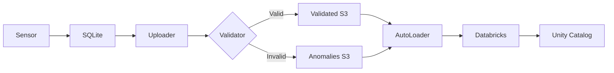

# Environmental Sensor Data Pipeline with Databricks and Bacalhau

A production-ready data pipeline for processing environmental sensor data (temperature, humidity, pressure, vibration, voltage) with real-time anomaly detection, multi-stage transformation, and Databricks Unity Catalog integration.

## 🚀 Quick Start

**For complete setup and demo instructions, see: [`MASTER_SETUP_AND_DEMO.md`](MASTER_SETUP_AND_DEMO.md)**

This is the single, authoritative guide that will take you from zero to a fully working demo.

## 📁 Project Structure

```
.
├── MASTER_SETUP_AND_DEMO.md    # ⭐ START HERE - Complete setup guide
├── .env.example                 # Environment configuration template
├── databricks-notebooks/        # Databricks AutoLoader notebooks
│   └── setup-and-run-autoloader.py  # Main AutoLoader notebook
├── databricks-uploader/         # Data validation and upload service
│   ├── sqlite_to_databricks_uploader.py
│   ├── environmental_sensor_models.py  # Pydantic models for sensor data
│   ├── environmental_transformer.py    # Data transformation logic
│   └── pipeline_manager.py
├── scripts/                     # Automation and utility scripts
│   ├── validate-env.sh         # Validate environment configuration
│   ├── create-all-buckets.sh   # Create S3 buckets
│   ├── seed-buckets-for-autoloader.py  # Seed buckets with sample data
│   ├── fix-external-locations-individual.py  # Fix external location URLs
│   ├── turbo-delete-buckets.py # Fast bucket deletion
│   ├── clean-all-data.sh       # Clean bucket contents
│   ├── start-environmental-sensor.sh  # Start environmental sensor
│   └── run-anomaly-demo.sh     # Run complete demo
├── docs/                        # Additional documentation
│   ├── DEVELOPMENT_RULES.md
│   ├── ENVIRONMENT_SETUP.md
│   └── QUICK_START_CHECKLIST.md
└── jobs/                        # Bacalhau job specifications
    └── databricks-uploader-job.yaml
```

## 🎯 Key Features

- **Multi-Stage Pipeline**: Raw → Validated → Anomalies → Schematized → Aggregated data flow
- **Anomaly Detection**: Physics-based validation for wind turbine data
- **Real-Time Processing**: Streaming ingestion with Databricks AutoLoader
- **Schema Evolution**: Automatic schema inference and validation
- **Unity Catalog**: Enterprise governance and data management
- **Containerized Services**: Docker-based sensors and uploaders

## 🔧 Architecture



## 📊 Pipeline Stages

1. **Raw Data**: All sensor readings as received
2. **Validated Data**: Readings that pass physics validation
3. **Anomalies**: Readings that violate physics rules
4. **Schematized Data**: Structured with enforced schema
5. **Aggregated Data**: Analytics-ready summaries

## 🚦 Anomaly Detection Rules

The system detects anomalies in environmental sensor data:
- **Temperature anomalies**: Values outside -20°C to 60°C range
- **Humidity anomalies**: Values outside 5% to 95% range  
- **Pressure anomalies**: Values outside 950-1050 hPa range
- **Vibration anomalies**: Values exceeding 10 mm/s²
- **Voltage anomalies**: Values outside 20-25V range
- **Sensor-flagged anomalies**: Records with anomaly_flag = 1 from sensor

## Prerequisites

- Python 3.11+
- Docker
- AWS Account with S3 access
- Databricks Workspace with Unity Catalog enabled
- `uv` package manager (`pip install uv`)
- Bacalhau CLI v1.5.0+

## 🏃 Complete Setup Process

### Phase 1: Environment Setup

1. **Clone and Configure**:
```bash
# Clone the repository
git clone <repo-url>
cd databricks-with-bacalhau

# Copy and configure environment
cp .env.example .env
# Edit .env with your credentials
```

2. **Validate Configuration**:
```bash
./scripts/validate-env.sh
```

### Phase 2: AWS Infrastructure

1. **Create S3 Buckets**:
```bash
./scripts/create-all-buckets.sh
```

This creates all required buckets:
- `expanso-raw-data-{region}`
- `expanso-validated-data-{region}`
- `expanso-anomalies-data-{region}`
- `expanso-schematized-data-{region}`
- `expanso-aggregated-data-{region}`
- `expanso-checkpoints-{region}`
- `expanso-metadata-{region}`

2. **Setup IAM Role**:
```bash
./scripts/create-databricks-iam-role.sh
./scripts/update-iam-role-for-new-buckets.sh
```

### Phase 3: Databricks Setup

1. **Setup Unity Catalog**:
```bash
cd scripts
uv run -s setup-unity-catalog-storage.py
```

2. **Fix External Locations** (Critical!):
```bash
# External locations may have wrong URLs - fix them
uv run -s fix-external-locations-individual.py
```

3. **Seed Buckets with Sample Data**:
```bash
# AutoLoader needs sample files to infer schemas
uv run -s seed-buckets-for-autoloader.py
```

4. **Upload and Run AutoLoader Notebook**:
```bash
uv run -s upload-and-run-notebook.py \
  --notebook ../databricks-notebooks/setup-and-run-autoloader.py
```

### Phase 4: Run the Demo

1. **Start Environmental Sensor**:
```bash
# Normal sensor (no anomalies)
./scripts/start-environmental-sensor.sh 300

# With anomalies (25% probability)
./scripts/start-environmental-sensor.sh 300 --with-anomalies
```

2. **Monitor Processing**:
   - Open Databricks workspace
   - Navigate to the uploaded notebook
   - Watch as data flows through all 5 pipeline stages
   - View anomalies being detected and routed

3. **Query Results**:
```sql
-- View ingested data
SELECT * FROM expanso_catalog.sensor_data.sensor_readings_ingestion;

-- View detected anomalies
SELECT * FROM expanso_catalog.sensor_data.sensor_readings_anomalies;

-- View aggregated metrics
SELECT * FROM expanso_catalog.sensor_data.sensor_readings_aggregated;
```

## 🔍 Troubleshooting

### Common Issues and Solutions

1. **AutoLoader Schema Inference Error**:
   - **Cause**: Empty buckets
   - **Solution**: Run `scripts/seed-buckets-for-autoloader.py`

2. **UNAUTHORIZED_ACCESS Error**:
   - **Cause**: External locations pointing to wrong bucket URLs
   - **Solution**: Run `scripts/fix-external-locations-individual.py`

3. **Permission Denied on External Locations**:
   - **Cause**: IAM role not updated for new buckets
   - **Solution**: Run `scripts/update-iam-role-for-new-buckets.sh`

4. **No Data Flowing**:
   - **Cause**: Checkpoints preventing reprocessing
   - **Solution**: Clean checkpoints with `scripts/clean-all-data.sh`

### Verification Scripts

```bash
# Check bucket structure
./scripts/check-bucket-structure.sh

# Verify Databricks setup
cd scripts && uv run -s verify-databricks-setup.py

# List external locations
uv run --with databricks-sdk --with python-dotenv python3 -c "
from databricks.sdk import WorkspaceClient
from dotenv import load_dotenv
import os
from pathlib import Path

load_dotenv(Path('.').parent / '.env')
w = WorkspaceClient(host=os.getenv('DATABRICKS_HOST'), token=os.getenv('DATABRICKS_TOKEN'))

print('External Locations:')
for loc in w.external_locations.list():
    if 'expanso' in loc.name.lower():
        print(f'  {loc.name}: {loc.url}')
"
```

## 📈 Monitoring

### Key Metrics to Track

- **Ingestion Rate**: Files/second being processed
- **Anomaly Rate**: Percentage of readings flagged
- **Processing Latency**: Time from sensor to Unity Catalog
- **Schema Evolution**: New columns being added

### Dashboard Queries

```sql
-- Anomaly detection rate
SELECT 
    DATE(processing_timestamp) as date,
    COUNT(*) as anomaly_count,
    AVG(wind_speed) as avg_wind_speed,
    AVG(power_output) as avg_power
FROM expanso_catalog.sensor_data.sensor_readings_anomalies
GROUP BY DATE(processing_timestamp)
ORDER BY date DESC;

-- Pipeline throughput
SELECT 
    stage,
    COUNT(*) as record_count,
    MAX(processing_timestamp) as last_update
FROM (
    SELECT 'ingestion' as stage, processing_timestamp 
    FROM expanso_catalog.sensor_data.sensor_readings_ingestion
    UNION ALL
    SELECT 'validated' as stage, processing_timestamp 
    FROM expanso_catalog.sensor_data.sensor_readings_validated
    UNION ALL
    SELECT 'anomalies' as stage, processing_timestamp 
    FROM expanso_catalog.sensor_data.sensor_readings_anomalies
)
GROUP BY stage;
```

## 🧹 Cleanup

To completely clean up all resources:

```bash
# Delete all S3 buckets and contents
./scripts/turbo-delete-buckets.py

# Clean Unity Catalog objects
cd scripts && uv run -s cleanup-unity-catalog.py

# Remove local artifacts
rm -rf .flox/run .env *.db *.log
```

## 📚 Additional Resources

- [Development Rules](docs/DEVELOPMENT_RULES.md) - Coding standards and best practices
- [Environment Setup Guide](docs/ENVIRONMENT_SETUP.md) - Detailed environment configuration
- [Quick Start Checklist](docs/QUICK_START_CHECKLIST.md) - Step-by-step verification
- [Master Setup Guide](MASTER_SETUP_AND_DEMO.md) - Complete walkthrough

## 🤝 Contributing

1. Follow the coding standards in `docs/DEVELOPMENT_RULES.md`
2. Always use `uv` for Python scripts
3. Test with both normal and anomaly data
4. Update documentation for any new features

## 📝 License

MIT License - See LICENSE file for details

## 🆘 Support

For issues or questions:
1. Check the [Master Setup Guide](MASTER_SETUP_AND_DEMO.md)
2. Review troubleshooting section above
3. Open an issue with:
   - Environment details (`.env` without secrets)
   - Error messages and logs
   - Steps to reproduce

## 🎉 Success Indicators

You know the pipeline is working when:
- ✅ All 5 S3 buckets have data flowing
- ✅ Unity Catalog tables are populated
- ✅ Anomalies are being detected and routed
- ✅ AutoLoader is processing files continuously
- ✅ No errors in Databricks notebook execution