# Distributed Data Warehouse with Bacalhau and DuckDB

This project demonstrates how to build a distributed data warehouse using Bacalhau and DuckDB. Instead of moving all data to a central warehouse, we bring compute to where data resides, enabling efficient multi-region analytics while maintaining data locality.

## Overview

Traditional data warehouses require moving all raw data to a central location, which can be expensive and time-consuming. This project showcases a different approach:

- Data stays in its local region
- Compute jobs run where data resides
- Only aggregated results move between regions
- DuckDB provides SQL capabilities at each node
- Bacalhau orchestrates distributed processing

## Architecture Overview

### High-Level Design

```mermaid
flowchart TB
    User(("👤 User"))
    Orchestrator["Global\nOrchestrator"]
    GlobalStorage[("Global\nResults Storage")]
    
    subgraph US["US Region"]
        direction TB
        USCompute1["Compute\nNode 1"]
        USCompute2["Compute\nNode 2"]
        USCompute3["Compute\nNode 3"]
        USStorage[("Regional\nStorage")]
    end

    subgraph EU["EU Region"]
        direction TB
        EUCompute1["Compute\nNode 1"]
        EUCompute2["Compute\nNode 2"]
        EUCompute3["Compute\nNode 3"]
        EUStorage[("Regional\nStorage")]
    end

    User --> Orchestrator
    Orchestrator --> US
    Orchestrator --> EU
    Orchestrator <--> GlobalStorage
    
    USCompute1 & USCompute2 & USCompute3 --> USStorage
    EUCompute1 & EUCompute2 & EUCompute3 --> EUStorage

    classDef primary fill:#f96,stroke:#333,stroke-width:2px
    classDef secondary fill:#fff,stroke:#333,stroke-width:2px
    classDef storage fill:#fcf,stroke:#333,stroke-width:2px
    
    class Orchestrator primary
    class USCompute1,USCompute2,USCompute3,EUCompute1,EUCompute2,EUCompute3 secondary
    class USStorage,EUStorage,GlobalStorage storage
```




### Key Components

- **Bacalhau Orchestrator**: Central control plane for job distribution
- **Compute Nodes**: Distributed across regions, running close to data
- **Local Storage**: Regional data stores (MinIO in this setup)
- **DuckDB**: SQL query engine running on compute nodes

## Why Bacalhau for Distributed Data Warehousing?

Bacalhau addresses several key challenges in distributed data processing:

1. **Compute-to-Data Movement**

   - Deploy compute nodes close to data sources
   - Minimize data movement across regions
   - Process data where it lives

2. **Distributed Orchestration**

   - Central control plane for job management
   - Region-aware job scheduling
   - Automatic node selection and constraints

3. **Efficient Partitioned Processing**

   - Built-in data partitioning capabilities
   - Parallel execution across nodes
   - Automatic workload distribution

4. **Query Engine Integration**
   - Works with any query engine (DuckDB in this case)
   - Extends single-instance engines to distributed scenarios
   - Adds orchestration and parallel execution capabilities

## DuckDB Integration

We use DuckDB as our query engine for several reasons:

- Excellent SQL support
- Direct file reading capabilities
- Fast analytical processing
- Simple deployment (single binary)

Bacalhau extends DuckDB's capabilities by:

- Adding distributed orchestration
- Enabling parallel processing
- Managing partitioned execution
- Handling job distribution

### Custom DuckDB Image

Our custom DuckDB image includes User-Defined Functions (UDFs) for partitioning:

- `partition_by_hash`: Even distribution of files
- `partition_by_regex`: Pattern-based partitioning
- `partition_by_date`: Time-based partitioning

## Data Access Patterns

Bacalhau supports two ways to access local data:

1. **Direct DuckDB Access**

```sql
SET VARIABLE files = (
  SELECT LIST(file)
  FROM partition_by_hash('s3://local-bucket/**/*.jsonl')
);
SELECT * FROM read_json_auto(getvariable('files'));
```

2. **Bacalhau Input Sources**

```yaml
InputSources:
  - Type: s3
    Source:
      Bucket: local-bucket
      Key: "data/*"
```

Each approach has its benefits:

- Direct access is simpler for SQL-only jobs
- Input sources provide more control and preprocessing options

## Quick Start

### Prerequisites
- Bacalhau CLI
- Docker and Docker Compose
- Access to example multi-region setup

### Deploy Environment
```bash
# Clone and start the multi-region environment
git clone https://github.com/bacalhau-project/examples.git
cd distributed-datawarehouse/duckdb/network
docker compose up -d

# Move to the jobs directory
cd ../jobs
```

### Generate Sample Data
```bash
# Generate US region data
bacalhau job run -V Region=us -V Events=3000 \
  -V StartDate=2024-01-01 -V EndDate=2024-12-31 \
  -V RotateInterval=month data-generator.yaml

# Generate EU region data
bacalhau job run -V Region=eu -V Events=3000 \
  -V StartDate=2024-01-01 -V EndDate=2024-12-31 \
  -V RotateInterval=month data-generator.yaml
```

### Run Your First Analysis
```bash
# Run monthly trends analysis
bacalhau job run -V Region=us monthly-trends.yaml
```

Sample output:
```
month       | total_txns | revenue  | unique_customers | avg_txn_value
------------|------------|----------|------------------|---------------
2024-03-01  |      3,421 | 178,932  |           1,245 |         52.30
2024-02-01  |      3,156 | 165,789  |           1,189 |         52.53
2024-01-01  |      2,987 | 152,456  |           1,023 |         51.04
```
   

## Analysis Jobs

### Operational Monitoring

1. **Hourly Operations** (`hourly-operations.yaml`)

- Tracks operational health metrics
- Monitors transaction success rates
- Shows hourly patterns

```bash
bacalhau job run -V Region=us hourly-operations.yaml
```

2. **Anomaly Detection** (`anomaly-detection.yaml`)

- Identifies unusual patterns
- Uses statistical analysis
- Flags significant deviations

```bash
bacalhau job run -V Region=us anomaly-detection.yaml
```

### Business Analytics

1. **Product Performance** (`product-performance.yaml`)

- Analyzes category performance
- Tracks market share
- Shows sales patterns

```bash
bacalhau job run -V Region=us product-performance.yaml
```

2. **Monthly Trends** (`monthly-trends.yaml`)

- Long-term trend analysis
- Monthly aggregations
- Key business metrics

```bash
bacalhau job run -V Region=us monthly-trends.yaml
```

### Customer Analysis

1. **Customer Segmentation** (Two-Phase)

- Phase 1: Compute local metrics
- Phase 2: Combine and segment

```bash
# Run Phase 1
bacalhau job run -V Region=us customer-segments-phase1.yaml
# Note the job ID, then run Phase 2
bacalhau job run -V Region=us -V JobID=<phase1-job-id> customer-segments-phase2.yaml
```

## Further Reading

- [Bacalhau Documentation](https://docs.bacalhau.org/)
- [DuckDB Documentation](https://duckdb.org/docs/)