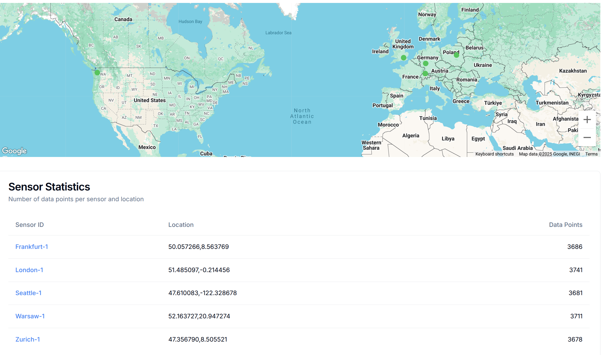
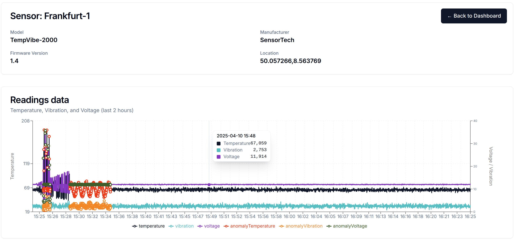

# FerretDB Sensor Data Demo

This project demonstrates a simulation of distributed sensors operating within the [Bacalhau](https://github.com/bacalhau-project/bacalhau) network. The sensors periodically send their data to a central [FerretDB](https://github.com/FerretDB/FerretDB) instance for storage and analysis.

The entire stack is orchestrated using Docker Compose and includes a user-friendly frontend for visualizing collected sensor data.

---

## 🧰 Prerequisites

1. [Docker](https://docs.docker.com/get-docker/) and [Docker Compose](https://docs.docker.com/compose/install/) installed.
2. A [Google Maps API Key](https://developers.google.com/maps/documentation/embed/get-api-key?hl=en).

### Configure Google Maps API Key

To load and use the Google Maps JavaScript API in your project, follow these steps:

**Enable the API & Obtain a Key**
- Go to the [Google Cloud Console](https://console.cloud.google.com/).
- Create (or select) a project.
- In the **APIs & Services** dashboard, click **Enable APIs and Services** and search for **Maps JavaScript API**.
- Click **Enable**, then navigate to **Keys & Credentials** → **Create credentials** → **API key**.
- Copy the generated key to docker compose file

## ⚙️ Setup

### 1. Configure the Environment

Create a `.env` file in the root directory with your Google Maps API key:

```dotenv
GOOGLE_MAPS_API_KEY=<your-google-maps-api-key>
```

### 2. Start the Services

There is a possibility to scale sensors to given number of instances (there will be one instance by default)

```bash
docker compose up -d --scale sensor=5
```

With the following command you will run only one instance of sensor:

```bash
docker compose up -d
```

This will download the necessary images (if not already present) and launch all services, including:

- Bacalhau Orchestrator
- PostgreSQL (FerretDB backend)
- FerretDB
- MinIO (S3-compatible object storage)
- 5 Sensor Nodes (as Bacalhau compute nodes)
- Frontend dashboard (http://localhost:3010)
- Bacalhau client

### Port Requirements

Ensure the following TCP ports are free:

- **3010** – Frontend
- **8438** – Bacalhau Web Interface
- **27217** – FerretDB (optional external access)
- **9001** – MinIO Web interface
- **Docker subnet `172.30.0.0/16`** must also be available.

> ⚠️ **Note:** FerretDB/PostgreSQL might not currently offer a Docker image for the ARM64 architecture.

---

## 🚀 Running the Demo

### 1. Preparation

As all Bacalhau jobs are using local private registry it is crucial to populate it before running them.
After bringing up all services with docker compose, run from the host machine:
```bash
private_registry_mirror_warmup.sh
```
This script will pull all job images from the Internet and push them to local registry.
> Volume for registry is exposed to the host machine, so data will still be there after removing everything with docker compose down.

### 2. Access the Frontend & Bacalhau Interface

- Frontend: [http://localhost:3010](http://localhost:3010)
- Bacalhau Web UI: [http://localhost:8438](http://localhost:8438)

### 3. Connect to the Client Container
**All jobs are to be run from client container.**

This is because the required environment variables are defined in their environment.
```bash
docker exec -ti ferret-demo-client bash
```

### 4. Start the Sensor Log Generator

```bash
/1_run_generate_sensor_logs_job.sh
```

This starts a **daemon job** that launches a sensor simulator on every sensor container. 
This should start very quickly, as job pulls image from local registry.

### 5. Start Data Transfer to FerretDB

```bash
/2_run_sync_sensor_logs_job.sh
```

This launches another **daemon job** that periodically transfers sensor data to FerretDB.

**Once second job is running, sensors will start appearing on the frontend map and sensor list.**

---

## 🔄 Alternative Data Transfer Mode

To reduce transfer volume, you can switch to an **averaged data sync** (once every 30 seconds):

### 6. Replace Sync Script with Averaged Transfer

```bash
/3_replace_sync_sensor_logs_script.sh
```

This runs an **ops job** on every sensor, replacing the default syncer script with one that averages data before transferring it to FerretDB.

To switch back to full data transfer, modify `3_replace_sync_sensor_logs_script.sh`:

```bash
NEW_SYNC_SCRIPT="scripts/average_syncer.py"
#NEW_SYNC_SCRIPT="scripts/sqlite_syncer.py"
```

Replace `NEW_SYNC_SCRIPT` as needed and rerun the script.

---

## 📊 Frontend Dashboard

- Each sensor appears on a Google Map and blinks when new data arrives.
- Sensors will turn red if anomalies are detected.
- Clicking a sensor (map or list) opens a chart view for detailed analysis.




---

## 🧹 Cleaning Up the Environment

To stop all services and **remove all containers, networks, and volumes created by Docker Compose**, run:

```bash
docker compose down -v
```

This command will:

- Stop all running containers
- Remove the containers and associated networks
- Remove named and anonymous volumes (e.g., any persistent FerretDB or MinIO data)

> ⚠️ Use with caution – this **will erase all sensor data and database contents**.

This is useful if you want to start from scratch or reclaim disk space after testing the demo.


## 🛠️ Troubleshooting

- Check container logs:

```bash
docker logs -f <container-name>
```

- To view all logs in real-time:

```bash
docker compose up
```

*(Remove the `-d` flag to stay attached and view colored logs.)*

- If the frontend map is blank, ensure `.env` exists and includes your Google Maps API key.


- If docker is complaining about overlapping network that already exists, try to prune networks that are not used anymore:
```bash
docker network prune
```

- If there are docker containers present that have the same names, try to prune them also:
```bash
docker container prune
```

---

## ✏️ Development Notes

You can freely edit:

- Job scripts (`jobs/`)
- Python scripts (`scripts/`)

These changes will reflect immediately in the running containers since relevant folders are mounted as volumes.
