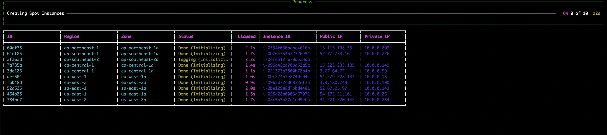
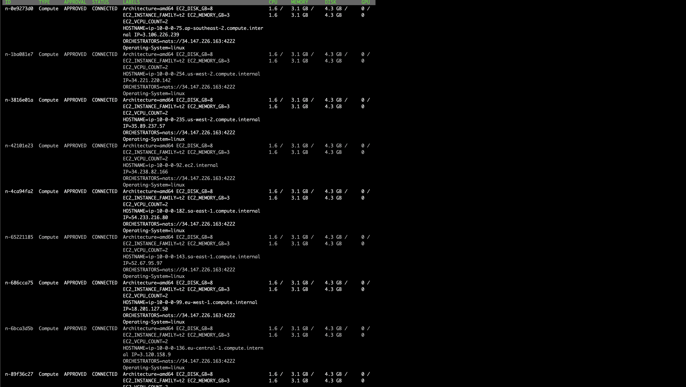
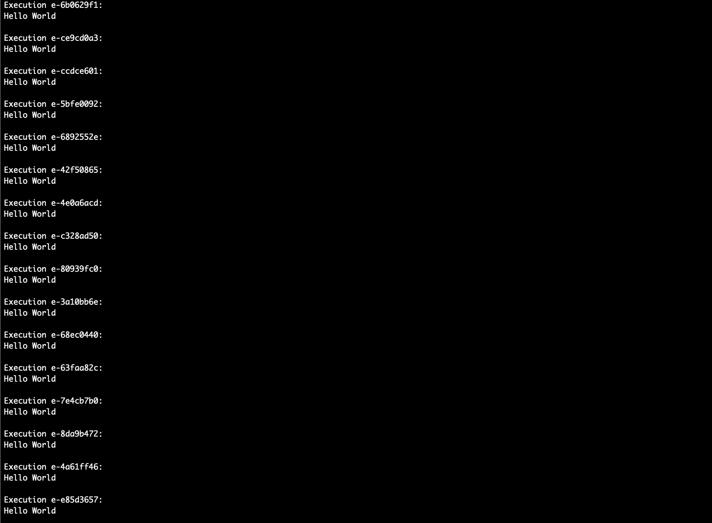

# Provisioning and adding AWS Spot Intances to your Bacalhau Network

With Big Data comes Big Costs - at least, that's the prevailing wisdom to date. But it doesn't always have to be the case. With Bacalhau, organisations can still work on their Big Data problems, but benefit from the greatly reduced costs that come with running a Distributed Compute network - Less bandwidth usage, more efficient compute utilisation, and the removal of the need to centralise resources.

But, we can still do more to keep our costs low whilst working on the big problems we have today. And we can do that with AWS Spot Instances.

## What is a Spot Instance?

A Spot Instance is a type of EC2 instance from a pool of unused EC2 capacity that AWS offers at a substantial discount. The utilisation of Spot Instances enables us to spin up a great number of EC2 instance types, but for a fraction of the cost of their on-demand counterparts. This makes them great options for running as Compute nodes as part of a Bacalhau network, but they come with a caveat: A Spot Instance can be reclaimed by AWS at any time. 

This presents a double-edged sword. Sure, we can get a great deal of compute for our Bacalhau networks and a greatly reduced price, but we can't guarantee how long they'll remain a part of our network.

## Not a problem!

Fortunately, this is the kinf of environment thst Bacalhau excels in. Bacalhau has been built from the ground-up to handle unreliable network and node availabilities - if a job can't be completed for whatever reason on a given node, Bacalhau will reschedule it elsewhere on the network. So, if a Spot Instance gets reclaimed by AWS, Bacalhau will reschedule the jobs on that node to run elsewhere on the network - fully utilising all available compute to ensure your jobs complete sucessfully.

To follow this content, head to GitHub and clone the examples repo to your local system - or, you can run `git clone https://github.com/bacalhau-project/examples` in your Terminal. This will create an `examples` folder on your system.

## Spinning up a Bacalhau Orchestrator

_If you already have a Bacalhau Requester Node setup somewhere, you can skip this section_

In order for our Bacalhau network to function, we first need to spin up a Requester node that our Compute nodes can connect to, and that we can interact with to fire off jobs to our network.

The `examples/spot` directory is where the scripts for provisioning our Spot Instances can be found. But, the script we're going to use first is the `create_requester.py` script. This script will create an On-Demand t2.medium EC2 instance and configure it to run as a Bacalhau Requester node.

To run the script enter:

`python3 create_requester.py`

This should take a few seconds to run, and will create a Security Group, ingress rules, and the EC2 instance in the `us-west-2` region. After it's completed, it will output the public IPv4 address of your new Requester Node.

Take note of this IP address, we'll need it shortly.

## Provisioning AWS Spot Instances

Once we have a Requester Node spun up, we can start provisioning AWS Spot Instances. `cd` up one level to the `examples/spot` directory. In here, we have a `main.py` file which we can use to specify the number of Spot Instance we want to provision and the IP address of our Requester node. We can also use this script to list the Spot Instances that have already been provisioned, as well as destroy them all after we've finished with them.

### Installing Dependencies

First, you'll need to install the requirements for the Python script to run, and to do that, we should first create a virtual environment. Run the following command `python3 -m venv VENV`, then run `source VENV/bin/activate`. This will start our virtual environment so we can be sure our dependencies don't conflict with anything in our system.

Next, run `pip3 install -r requirements.txt`. This will install everything our Python script needs to provision our Spot Instances.

### Creating our Spot Instances

Once we have all of our dependencies installed, we're ready to spin up our Spot Instances!

In your CLI run the following command:

`main.py create --orchestrators "nats://<YOUR REQUESTER NODES IP ADDRESS>:4222" --no-of-instances 10`

A table will appear showing you the progress of the Python script as it provisions your instances. This will provision 10 Spot Instances of the "t2.medium" type. 

The `--orchestrators` flag is how we tell our script where it can set our Compute Nodes to find our Requester Nodes once they've finished spinning up, and Bacalhau is installed and running,

The `--no-of-instances` flag lets you set how many Spot Instances you want to provision and configure as Bacalhau Compute nodes.

### Verifying our Setup

Once all of our instances have been provisioned, we can use the Bacalhau CLI to connect to our requester node and list all of the Compute Nodes that have connected to it and are ready to receive jobs. Run the following command in your Terminal:

`bacalhau --api-host=<YOUR REQUESTER NODE IP ADDRESS> node list --filter-status="connected"`

You should see a list of nodes connected to your requester node, and they should have an approval status of `APPROVED` and a STATUS of `CONNECTED`.

### Running a Job

Now that we have a Bacalhau network all spun up, we can submit a job to the Compute Nodes.

In the `examples/spot` folder, there's a `demo_job.yaml` file. It's an Ops Job, so it will run on all Compute Nodes connected in our Bacalhau network, and all it's going to do is echo out a "Hello, World" program for us. Not a complex task, but enough to show that everything is working as expected.

To run the job on all nodes, enter the following command into your CLI:

`bacalhau --api-host=<YOUR REQUESTER NODE IP ADDRESS> job run demo_job.yaml --template-vars "greeting=Hello,name=World"`

This should take a few seconds to complete, and once it's done, you should see something like the following:

To get the results of all of the Jobs that have been run, we can run the following command:

`bacalhau --api-host=<YOUR REQUESTER NODE IP ADDRESS> job describe <JOB ID RETURNED BY BACALHAU CLI>`

### Cleaning up

If you've finished with your Spot Instances, you can delete the instances and associated resources by running:

`python3 main.py destroy`

## Conclusion

In summary, combining Bacalhau and AWS Spot Instances offers a powerful opiotn to run your distributed computing at scale without the usual huge bills attached to it.